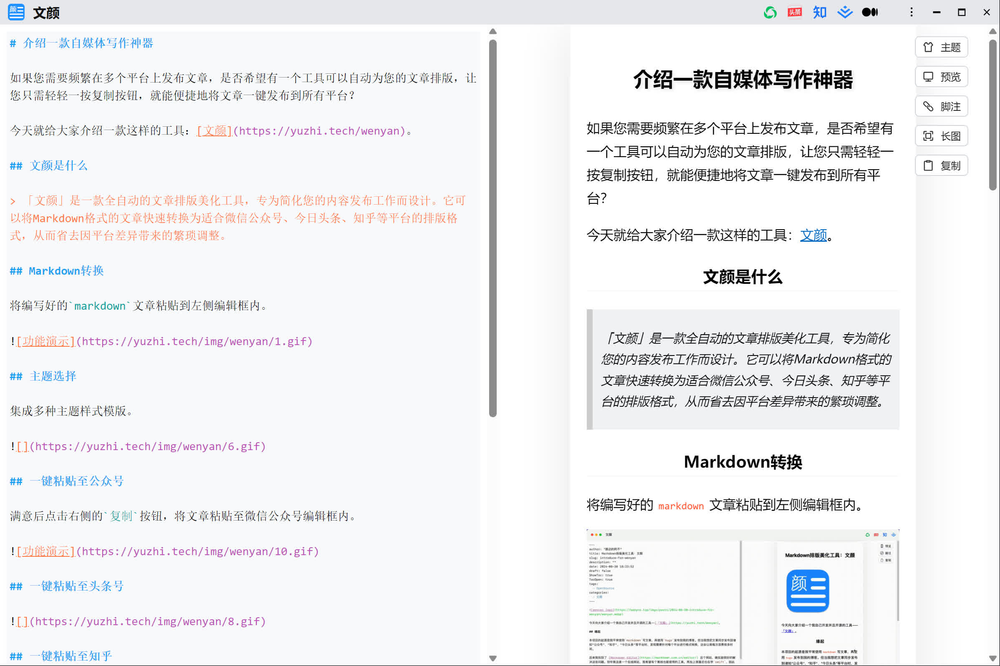

<div align="center">
    
</div>

# 文颜

[](https://yuzhi.tech/docs/wenyan/download)
[](https://yuzhi.tech/docs/wenyan)
[](LICENSE)
[](https://github.com/caol64/wenyan-pc)

## 简介

**[文颜（Wenyan）](https://wenyan.yuzhi.tech)** 是一款多平台 Markdown 排版与发布工具，支持将 Markdown 一键转换并发布至：

-   微信公众号
-   知乎
-   今日头条
-   以及其它内容平台（持续扩展中）

文颜的目标是：**让写作者专注内容，而不是排版和平台适配**。

## 文颜的不同版本

文颜目前提供多种形态，覆盖不同使用场景：

* [macOS App Store 版](https://github.com/caol64/wenyan) - MAC 桌面应用
* 👉 [跨平台版本](https://github.com/caol64/wenyan-pc) - 本项目
* [CLI 版本](https://github.com/caol64/wenyan-cli) - 命令行 / CI 自动化发布
* [MCP 版本](https://github.com/caol64/wenyan-mcp) - AI 自动发文
* [UI 库](https://github.com/caol64/wenyan-ui) - 桌面应用和 Web App 共用的 UI 层封装
* [核心库](https://github.com/caol64/wenyan-core) - 渲染、排版等核心能力

## 功能特性

本项目的核心功能是将编辑好的`markdown`文章转换成适配各个发布平台的格式，通过一键复制，可以直接粘贴到平台的文本编辑器，无需再做额外调整。

-   使用内置主题对 Markdown 内容排版
-   自动处理并上传本地图片，[阅读文档](https://yuzhi.tech/docs/wenyan/upload)
-   支持数学公式（MathJax）
-   支持发布到多平台：
    -   公众号
    -   知乎
    -   今日头条
    -   掘金、CSDN 等
    -   Medium
-   支持代码高亮
-   支持链接转脚注
-   支持识别`front matter`语法
-   自定义主题
    -   支持自定义样式
    -   支持导入现成的主题
    -   [使用教程](https://babyno.top/posts/2024/11/wenyan-supports-customized-themes/)
    -   [功能讨论](https://github.com/caol64/wenyan/discussions/9)
    -   [主题分享](https://github.com/caol64/wenyan/discussions/13)
-   支持导出长图

## 主题效果预览

👉 [内置主题预览](https://yuzhi.tech/docs/wenyan/theme)

## 应用截图



## 更多功能介绍

[https://wenyan.yuzhi.tech/](https://wenyan.yuzhi.tech/)

## 下载安装包

[https://yuzhi.tech/docs/wenyan/download](https://yuzhi.tech/docs/wenyan/download)

## 从源码运行

本项目使用`tauri`进行开发，需要事先已经安装`rust`和`node`环境。

**克隆仓库**

```sh
git clone --recursive https://github.com/caol64/wenyan-pc
```

**安装依赖**

```sh
pnpm install
```

**同步ui组件**

```sh
pnpm ui:sync
```

**运行**

```sh
pnpm tauri:dev
```

## 如何贡献

- 通过 [Issue](https://github.com/caol64/wenyan-pc/issues) 报告**bug**或进行咨询。
- 提交 [Pull Request](https://github.com/caol64/wenyan-pc/pulls)。
- 分享 [自定义主题](https://github.com/caol64/wenyan/discussions/13)。
- 推荐美观的 `Typora` 主题。

## 特别感谢

- @xsxz01 贡献的代码将`Tauri v1` 升级至 `Tauri v2`。
- @sumruler 贡献的[物理猫-薄荷](https://github.com/sumruler/typora-theme-phycat)主题。

## 赞助

如果你觉得文颜对你有帮助，可以给我家猫咪买点罐头 ❤️

[https://yuzhi.tech/sponsor](https://yuzhi.tech/sponsor)

## License

Apache License Version 2.0
